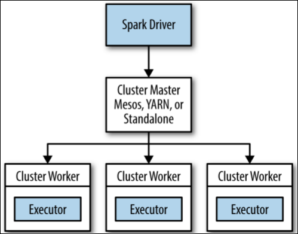

# Running on a Cluster

## Introduction

 > Users can rapidly prototype applications on smaller datasets locally, then run unmodified code on even very large clusters.

 - Runtime architecture of a distributed Spark application
 - Options for running Spark in distributed clusters
 - Trade-offs and configurations required for running in different options
 - "nuts and bolts" of scheduling, deploying, and configuring a Spark application

## Spark Runtime Architecture

 In distributed mode, Spark uses a **master/slave architecture** with one central coordinator (*driver*) and many distributed workers (*executor*).
 The Spark application is launched on a set of machines using a service called a **cluster manager**.

 

### The Driver

 - creates a SparkContext, creates RDDs, performs transformations and actions
 - Converting a user program into tasks (converts the logical graph, **DAG**, into physical execution plan)
 - Scheduling tasks on executors

 > Spark performs several optimizations, such as “pipelining” map transformations together to **merge them**, and **converts the execution graph into a set of stages**.
 Each stage, in turn, consists of multiple tasks. The **tasks are bundled up and prepared** to be **sent to the cluster**. **Tasks are the smallest unit** of work in Spark;

 The driver has a **complete view of the application’s executors** at all times.

 The Spark driver will look at the current set of executors and try to **schedule each task basing on data placement**.

 The driver also tracks the **location of cached data** and **uses it to schedule future tasks** that access that data.

### Executors

 Responsible for running the individual tasks

 - **run the tasks and return results** to *the driver*
 - provide **in-memory storage** for RDDs (RDDs are cached directly inside of executors)

### Cluster Manager

### Launching a Program

### Summary

## Deploying Applications with spark-submit

## Packaging Your Code and Dependencies

### A Java Spark Application Built with Maven

### A Scala Spark Application Built with sbt

### Dependency Conflicts

## Scheduling Within and Between Spark Applications

## Cluster Managers

### Standalone Cluster Manager

### Hadoop YARN

### Apache Mesos

### Amazon EC2

## Which Cluster Manager to Use?

